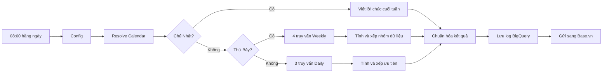

# Daily 5 Minutes Brief

Workflow n8n này tự động tổng hợp dữ liệu CRM thành một bản brief ngắn để team đọc trong khoảng 5 phút. Hệ thống có ba nhánh theo ngày chạy:

- Thứ Hai–Thứ Sáu: báo cáo Daily, tập trung vào một nhóm khóa học theo lịch.
- Thứ Bảy: báo cáo Weekly, nhìn lại toàn bộ tuần và các khóa đang hoạt động.
- Chủ Nhật: chỉ gửi một lời chúc cuối tuần, không chạy các truy vấn KPI.

Workflow chạy lúc **08:00 mỗi ngày**, theo múi giờ `Asia/Ho_Chi_Minh`.

## File quan trọng

```text
.
├── README.md                              # Tài liệu bắt đầu từ đây
├── dim_course_daily_brief.xlsx            # Danh mục khóa học và lịch nhóm khóa
├── workflow/
│   └── Daily-5-Minutes-Brief.json         # Workflow hiện tại, bản an toàn để đưa lên GitHub
├── docs/
│   ├── SQL_QUERIES.md                     # Toàn bộ SQL, input và output
│   ├── SETUP_DATABASE.md                  # Hướng dẫn tạo các bảng hỗ trợ
│   ├── DATA_SCHEMA_REFERENCE.md           # Tham chiếu schema CRM
│   └── SPECIFICATION_V3.md                # Đặc tả chi tiết của phiên bản hiện tại
├── archive/
│   ├── workflows/                         # Các phiên bản workflow cũ
│   └── development/                       # Spec, plan và test artifact cũ
└── private/                               # Bản export gốc có webhook thật; không đưa lên Git
```

## Luồng chạy tổng quát



Điểm quan trọng: các node SQL và Code chịu trách nhiệm tính toán. OpenAI chỉ nhận dữ liệu đã tính sẵn để viết lại thành bản tin dễ đọc; model không được tự đổi số hay tự tính lại KPI.

## Lịch nhóm khóa học

Nguồn chính thức là [dim_course_daily_brief.xlsx](dim_course_daily_brief.xlsx). Cột `report_day` hiện được dùng như **thứ của ngày workflow chạy**, dù tên cột có chữ “report”. Dữ liệu Daily vẫn lấy đến hết ngày hôm trước.

| Ngày workflow chạy | `report_day` | Nội dung |
|---|---:|---|
| Thứ Hai | 2 | 6 khóa Marketing nền tảng/case |
| Thứ Ba | 3 | 8 khóa Marketing Growth, Digital và Brand |
| Thứ Tư | 4 | 6 khóa Executive Education |
| Thứ Năm | 5 | 6 khóa Data School |
| Thứ Sáu | 6 | 10 khóa AI, Flexible Combo và B2B |
| Thứ Bảy | 7 | Weekly Brief cho toàn bộ khóa đang active |
| Chủ Nhật | 0 | Lời chúc cuối tuần, không có KPI |

Workbook hiện có **36 khóa active** và **5 khóa inactive**. `aliases` giúp gộp các cách ghi tên khóa khác nhau trong CRM về cùng một khóa chuẩn.

## Từng node làm gì?

### 1. Khởi động và xác định ngày

| Node | Vai trò dễ hiểu |
|---|---|
| `Schedule Trigger` | Tự khởi động workflow lúc 08:00 mỗi ngày. |
| `Manual Trigger` | Chạy thử bằng tay. Node này đang tắt trong bản export hiện tại. |
| `Config` | Giữ các ngưỡng đánh giá, số lượng ưu tiên, giới hạn Top N và các feature flag. Đây là nơi chỉnh “luật chơi” mà không phải sửa nhiều node. |
| `Resolve Calendar` | Xác định ngày chạy, ngày báo cáo, các khoảng 7/30/90 ngày, tuần hiện tại/tuần trước và nhánh Daily/Weekly/Sunday. |
| `Is Sunday?` | Nếu là Chủ Nhật thì chuyển sang nhánh lời chúc. |
| `Is Saturday?` | Nếu là Thứ Bảy thì chuyển sang Weekly; các ngày còn lại chuyển sang Daily. |

### 2. Nhánh Chủ Nhật

| Node | Vai trò dễ hiểu |
|---|---|
| `Sunday Message Writer` | Viết đúng một câu chúc cuối tuần, không kèm KPI hoặc giao việc. |
| `OpenAI Model - Sunday` | Model `gpt-4.1`, temperature 0.9 để câu chữ tự nhiên hơn. |
| `Assemble Sunday` | Đưa lời chúc về cùng cấu trúc dữ liệu với Daily và Weekly để dùng chung phần log/gửi tin. |

### 3. Nhánh Daily — Thứ Hai đến Thứ Sáu

| Node | Vai trò dễ hiểu |
|---|---|
| `Q0 Daily Data Health` | Kiểm tra Lead hôm qua có thiếu tên khóa hoặc có tên chưa map vào danh mục chuẩn hay không. |
| `Q1 Daily Overall Funnel` | Tổng hợp bức tranh chung: Lead, MQL, Discovery, Need-fit, Won và Lost; so sánh 7 ngày gần nhất với 7 ngày trước. |
| `Q2 Daily Focus Trend` | Lấy xu hướng riêng cho đúng nhóm khóa của ngày, gồm 7 ngày hiện tại và baseline 7/30/90 ngày. |
| `Build Daily Payload` | Chuẩn hóa số, xác định tăng/đi ngang/giảm, gắn trạng thái xanh–cam–đỏ, xếp ưu tiên và tạo nội dung hướng dẫn hành động. |
| `Daily Brief Writer` | Viết bản Daily theo template compact cho Base.vn, giữ nguyên mọi con số và thứ tự đã tính. |
| `OpenAI Model - Writer` | Model `gpt-4.1`, temperature 0.2 để output ổn định và ít sáng tạo sai lệch. Dùng chung cho Daily và Weekly. |
| `Assemble Daily` | Đóng gói bản tin, payload gốc và metadata để lưu log/gửi đi. |

### 4. Nhánh Weekly — Thứ Bảy

| Node | Vai trò dễ hiểu |
|---|---|
| `Q3 Weekly Overall Funnel` | So sánh tổng funnel tuần này với tuần trước. |
| `Q4 Weekly Course Performance` | Tổng hợp hiệu quả theo từng khóa, lịch sử Lead, Won/Lost và số deal open quá lâu. |
| `Q5 Weekly Content Performance` | Xếp hạng nguồn/content theo số Lead, Won, Lost và CVR cohort. |
| `Q6 Weekly Data Health` | Kiểm tra mapping tên khóa và tỷ lệ Lead thiếu `utm_content` trong tuần. |
| `Build Weekly Payload` | Tính direction, xếp khóa vào `good / watch / action_now`, tạo các nhóm pattern, Top nguồn, danh sách no-lead và ưu tiên tuần sau. |
| `Weekly Brief Writer` | Viết bản Weekly gồm đúng 5 phần, dành cho quản lý và không phân tích dài từng khóa. |
| `Assemble Weekly` | Làm sạch một số Markdown Base.vn không hỗ trợ và đóng gói kết quả. |

### 5. Ghi log và gửi tin

| Node | Vai trò dễ hiểu |
|---|---|
| `Final Output` | Tạo field `final_brief_text`, là nội dung cuối cùng dùng để gửi. |
| `Log Payload` | Chỉ giữ các field cần thiết cho bảng log. |
| `Log Run` | Insert một dòng vào `tmdatabase.dm_daily_brief.brief_run_log`. |
| `HTTP Request - Khánh` | Gửi bản tin sang webhook Base.vn. Bản GitHub đã thay URL thật bằng placeholder. |
| `HTTP Request - Hưng` | Kênh gửi thứ hai nhưng đang tắt. Bản GitHub cũng dùng placeholder. |

## Input và output chính

Input:

- `tmdatabase.dm_base_crm.deals`: dữ liệu Lead/deal, trạng thái funnel, Won/Lost và UTM.
- `tmdatabase.dm_daily_brief.dim_course`: bảng mapping khóa học; nội dung được quản lý từ file Excel trong repo.
- `Config` và `Resolve Calendar`: ngưỡng đánh giá và khoảng thời gian cần đọc dữ liệu.

Output:

- Một bản tin Daily, Weekly hoặc Sunday dạng text.
- Một dòng log trong `tmdatabase.dm_daily_brief.brief_run_log` gồm payload, output, trạng thái và thời gian gửi.
- Tin nhắn POST sang Base.vn.

Chi tiết từng query và danh sách field output nằm trong [docs/SQL_QUERIES.md](docs/SQL_QUERIES.md).

## Cần kiểm tra trước khi chạy production

1. Trong node `Resolve Calendar`, dòng lấy thời gian thật `const now = new Date();` hiện đang bị comment, còn ngày test `2026-08-30` đang được bật. Nếu import nguyên file, workflow sẽ luôn đi vào nhánh Chủ Nhật. Hãy bật lại dòng thời gian thật và comment dòng test trước khi activate.
2. File workflow trên GitHub không chứa webhook thật và được để ở trạng thái `active: false`. Hãy thay hai URL placeholder hoặc cấu hình lại trực tiếp trong n8n, test xong rồi mới activate.
3. Sau khi import, kết nối lại credential BigQuery và OpenAI trên môi trường n8n đích.
4. Kiểm tra các `stage_id` dùng cho MQL, Discovery và Need-fit nếu CRM thay đổi stage.
5. Chạy thử bằng Manual Trigger cho đủ ba tình huống Daily, Weekly và Sunday trước khi bật lịch.

## Nguyên tắc bảo mật khi đưa lên GitHub

- Không commit thư mục `private/`.
- Không đưa URL webhook, API key, access token hoặc file credential lên repository.
- Bản gốc có webhook thật chỉ để dùng nội bộ. Nếu một webhook từng bị public, nên rotate webhook đó thay vì chỉ xóa khỏi Git history.
- Nếu repo đã từng được push trước khi làm sạch, cần kiểm tra lại Git history vì secret có thể vẫn tồn tại trong commit cũ.

## Xem lại phiên bản cũ

Các workflow v1 đến v3.2 nằm trong [archive/workflows](archive/workflows). Tài liệu thiết kế, test payload, smoke test và implementation report cũ nằm trong [archive/development](archive/development). Các bản archive dùng để tra cứu, không nên import nhầm thay cho bản trong `workflow/`.
